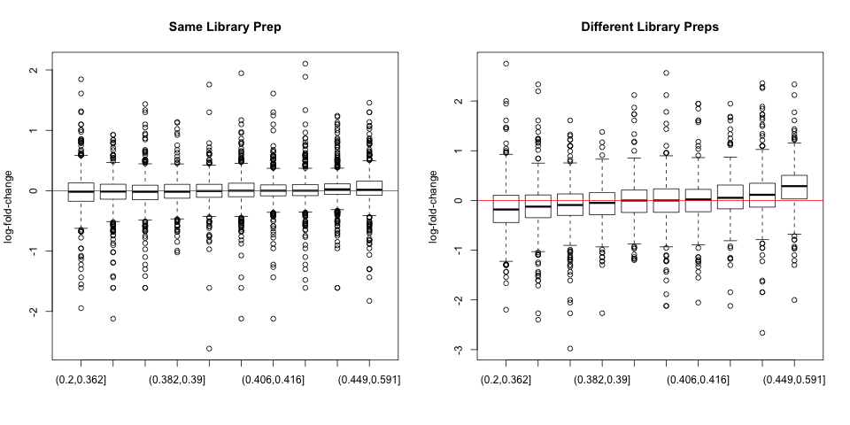

GC-content normalization for RNA-Seq data
========================================================

**Paper:** Risso, D., Schwartz, K., Sherlock, G. & Dudoit, S. GC-content normalization for RNA-Seq data. BMC Bioinformatics 12, 480 (2011).

**Group:** Jun Hwang, Caitlin McHugh, David Whitney.

Introduction
=============
_Discuss RNA-seq methodology briefly. Redefine lanes._

_Why do we need to do within/between-lane normalizations?_

The authors present three approaches to within-lane normalization. The goal of each method of normalization is to adjust for dependence of read counts on GC-content. The three approaches discussed are as follows.

1. **Regression normalization.** Regress the counts on GC-content and subtract the loess fit from the counts to remove dependence.

2. Global-scaling normalization

3. **Full-quantile normalization.** Force the distribution of counts to be the same across bins of genes based on GC-content.

Implementations of the within-lane and between-lane methods used in the paper are available from the `EDASeq` package in R/Bioconductor.

Data: What Samples?
=============
14 Saccharomyces cerevisiae **yeast** samples were used to test the normalization techniques.
Among the 14 samples, there are
- Three different growth conditions: standard YP Glucose (YPD), Delft Glucose (Del) and YP Glucerol (Gly)
- Two library preparation protocols: 1 and 2
- Five flow cells: 428R1, 4328B, 61MKN, 247L, 62OAY

Factor | Biological or Technical?
 ---|---
Growth conditions | biological
Library prep | technical
Flow cell | technical

Data: How Did We Prepare Them?
=============
- Data were _downloaded_ from NCBI's Sequence Read Archive (SRA), accession number SRA048710
- Then data were _aligned_ to the yeast reference genome using the `RBowtie` package

<small>**Note:** the authors did not specify which reference genome they used for alignment</small>

- The aligned SAM files were converted to BAM format using the `Rsamtools` package
- Finally, genes were _filtered_ out if

max(average read count within growth conditions)<10 

**We were unable to mirror exactly the counts the authors present**

Data: Download Again
=============
After completing the SRA downloads and running the alignment, we discovered the authors provide the read counts for all 14 yeast samples online.

All remaining analyses use read counts from **5,690 filtered genes**, as provided by the authors.

Analyses Using New Methods
==========================
To account for GC-content bias within lanes and technical differences between lanes, there are three steps to each analysis.

1. Apply _within-lane_ normalization.

2. Apply _between-lane_ normalization.

3. Perform differential expression analysis (package: `edgeR`).

Full-quantile Normalization
==========================
 **Goal:** make _distribution_ of log(read counts) the same across bins

0. Bin J genes into K bins based on GC-content

1. Form a matrix of log(read counts) $X_{\frac{J}{K} \times K}$ where each column is a bin
 
2. Sort each column (bin) of $X_{\frac{J}{K} \times K}$ = $X_{sort}$

3. Take mean by row, create vector $\mathbf{m}$

4. Make $X'_{sort}$ that has entries of row means

5. Put columns back in original order of $X$, create $X_{norm}$

Full-quantile Normalization: An Example
==========================
$X$ =

  |  |  |
 ---|---|---
**3** | **7** | **2**
_5_ | _1_ | _6_
1 | 4 | 3

$X_{sort}$ = 

 | | |
 ---|---|---
 _5_ | **7** | _6_
**3** | 4 | 3
1 | _1_ | **2**
***
$\mathbf{m}$ = (6,3.3,1.3)

$X'_{sort}$ = 

 | | |
 ---|---|---
 _6_ | **6** | _6_
**3.3** | 3.3 | 3.3
1.3 | _1.3_ | **1.3**

$X_{norm}$ = 

 | | |
 ---|---|---
**3.3**  | **6** |**1.3**
_6_ | _1.3_ | _6_ 
1.3 |  3.3 | 3.3

Evaluation of New Methods
==========================
Bias, MSE, Type I error rate, p-value distributions.
Should we talk about the null pseudo-datasets here?

Results of Normalization Methods: Read Count
==========================
GC-content differs across cultures but is similar for the same cultures.

Results of Normalization Methods: Log fold change
==========================
Fold change vs GC-content in the same culture with different flow cells (left) and
different cultures from the same flow cell (right).

Results of Normalization Methods: Normalized log fold change
==========================
Normalized fold change vs GC-content using proposed normalization techniques.

Results of Normalization Methods: Bias, MSE
==========================

Results of Normalization Methods: Type I error
==========================

